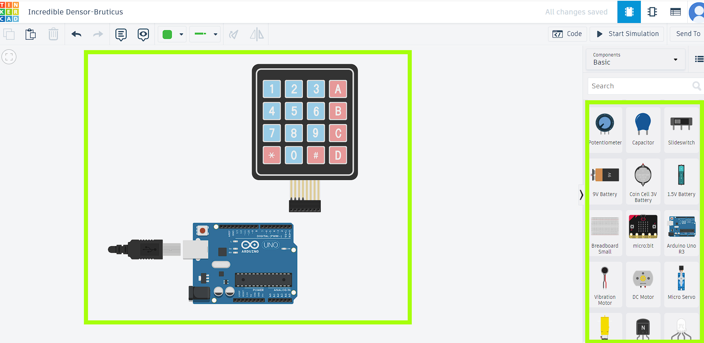
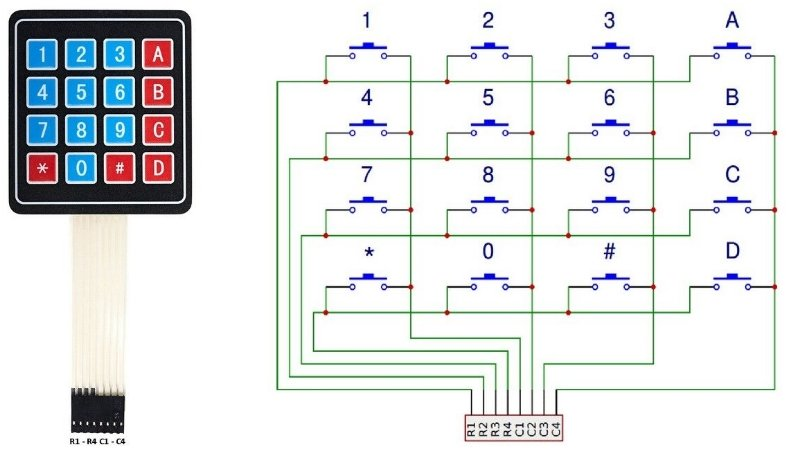
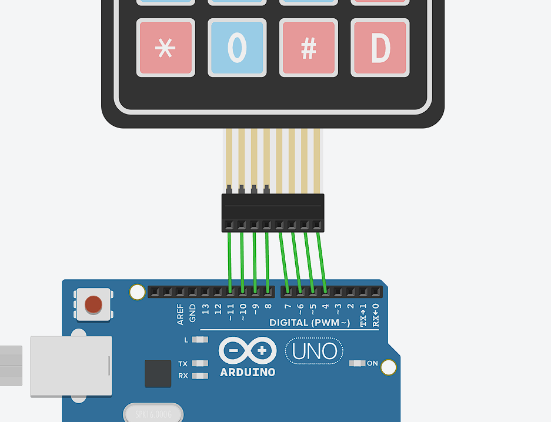
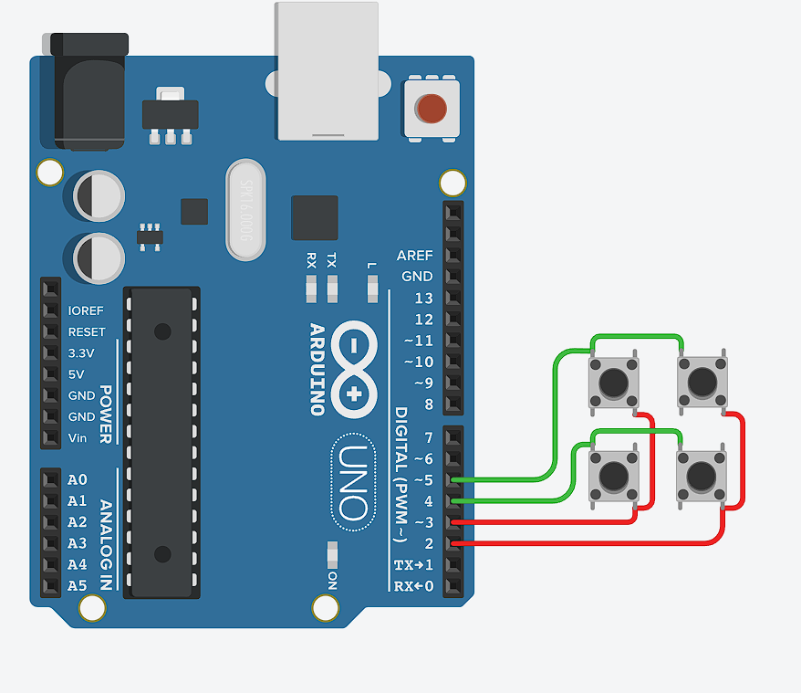
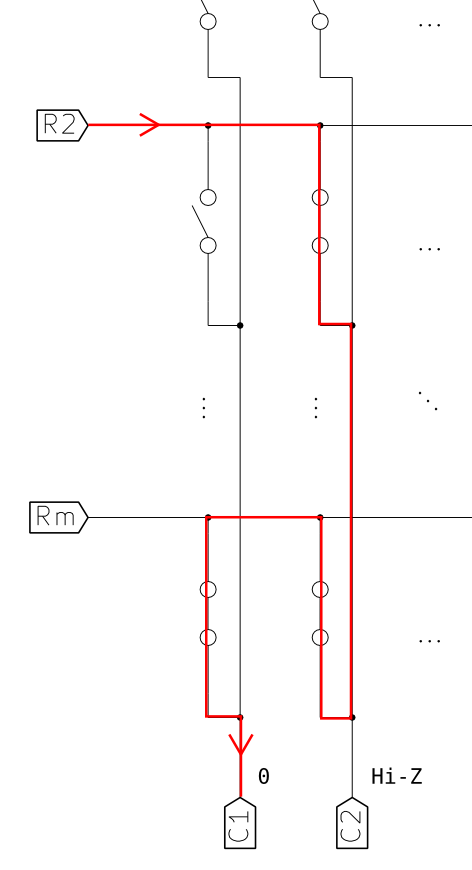
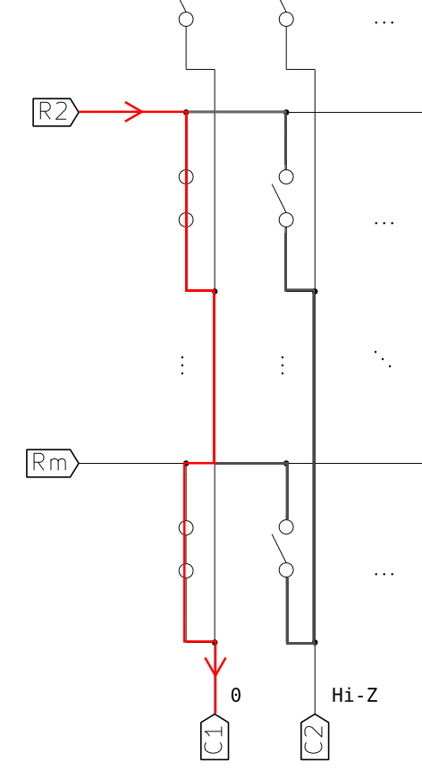
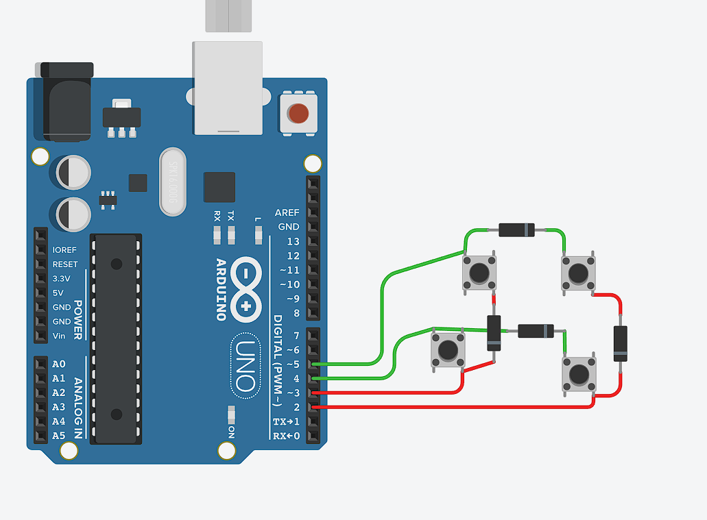

=====================
Матричная клавиатура
=====================

В этом уроке мы создадим матричную клавиатуру с помощью Arduino UNO. Матричная клавиатура - это тип клавиатуры, в которой кнопки соединены в матрицу из рядов и столбцов. Это эффективный способ подключения нескольких кнопок к Arduino с использованием минимального количества пинов. Для выполнения работы мы будем использовать сайт https://www.tinkercad.com , который имеет инструментарий для работы платы микроконтроллера Arduino UNO, но если у вас есть набор-комплект Ардуино вы можете собрать его самостоятельно по этому уроку. 

Введение
---------

Для работы на сайте вам понадобиться зарегистрироваться на сайте и создать новый проект.

Далее нам нужно взять из меню справа необходимые компоненты а именно "Arduino Uno R3" и уже собранную матричную клавиатуру "Keypad 4x4"

Схема матричной клавиатуры представляет собой способ подключения 16 кнопок в виде матрицы 4x4 к микроконтроллеру Arduino. Вместо того, чтобы подключать каждую кнопку к отдельному пину Arduino, матричная клавиатура использует эффективную схему, которая позволяет сократить количество необходимых пинов.

Вот как выглядит типичная схема матричной клавиатуры 4x4

В этой есть 4 строки (ряда) и 4 столбца. Каждая кнопка находится на пересечении строки и столбца. Чтобы подключить эту клавиатуру к Arduino UNO, вам нужно будет подключить строки к пинам цифрового вывода Arduino, а столбцы - к пинам входа.

Подключите строки клавиатуры (Row 1 - Row 4) к пинам цифрового вывода Arduino, например, к пинам 8, 9, 10, 11.
Подключите столбцы клавиатуры (Column 1 - Column 4) к пинам входа Arduino, например, к пинам 4, 5, 6, 7.

Используя эту схему, вы можете контролировать состояние 16 кнопок с помощью только 8 пинов Arduino. Микроконтроллер сканирует строки и столбцы, чтобы определить, какая кнопка нажата. Это достигается путем подачи напряжения на одну строку за раз и проверки состояния столбцов, чтобы определить, какая кнопка на пересечении была нажата.

Для обработки нажатий клавиш и определения, какая кнопка была нажата, можно использовать библиотеку Keypad для Arduino. Эта библиотека упрощает процесс считывания и интерпретации нажатий клавиш в матричной клавиатуре.

Код программы
--------------
Чтобы начать писать код для подключение сменим во вкладке "Code" режим с "Bloks" на режим "Text"

Подключим библиотеку "Keypad" и объявим две переменные наших столбцов и строк

.. code-block:: cpp

   #include <Keypad.h>
    const byte ROWS = 4;
    const byte COLS = 4;

Также нам нужно создать двумерный массив, назвоём его keys. Этот массив используется для сопоставления нажатых клавиш с их соответствующими символами. Когда вы считываете нажатие клавиши с клавиатуры, вы можете использовать этот массив, чтобы определить, какой символ соответствует данной кнопке.

.. code-block:: cpp

    char keys[ROWS][COLS] = {
    {'1', '2', '3', 'A'},
    {'4', '5', '6', 'B'},
    {'7', '8', '9', 'C'},
    {'*', '0', '#', 'D'}
    };

Определим ещё два массива rowPins и colPins

.. code-block:: cpp

    byte rowPins[ROWS] = {11, 10, 9, 8};
    byte colPins[COLS] = {7, 6, 5, 4};

Эти массивы используются для настройки клавиатуры и указания Arduino, какие пины используются для считывания нажатий клавиш. Библиотека Keypad использует эту информацию для сканирования строк и столбцов, чтобы определить, какая кнопка была нажата.

Создадим экземпляр класса Keypad и инициализируем его с помощью заданных параметров.

.. code-block:: cpp

    Keypad matrix = Keypad(makeKeymap(keys), rowPins, colPins, ROWS, COLS);

В функции setup() мы инициализируем связь с монитором последовательного порта и начинаем работу с клавиатурой.

.. code-block:: cpp

    void setup() {
    Serial.begin(9600);
    keypad.begin(makeKeymap(keys));
    }

В функции loop() мы используем метод getKey() класса Keypad для считывания нажатых клавиш.

.. code-block:: cpp

    void loop() {
    char key = keypad.getKey();
       if (key) {
           Serial.println(key);
       }
    }

Таким образом благодаря библиотеке Keypad мы получим очень компактный и простой код

Вот полный код программы:

.. code-block:: cpp

    #include <Keypad.h>
    const byte ROWS = 4;
    const byte COLS = 4;
    char keys[ROWS][COLS] = {
    {'1', '2', '3', 'A'},
    {'4', '5', '6', 'B'},
    {'7', '8', '9', 'C'},
    {'*', '0', '#', 'D'}
    };
    byte rowPins[ROWS] = {11, 10, 9, 8};
    byte colPins[COLS] = {7, 6, 5, 4};
    Keypad keypad = Keypad(makeKeymap(keys), rowPins, colPins, ROWS, COLS);
    void setup() {
    Serial.begin(9600);
    keypad.begin(makeKeymap(keys));
    }
    void loop() {
    char key = keypad.getKey();
       if (key) {
           Serial.println(key);
       }
    }

Матричная клавиатура 2x2
-------------------------

Для лучшего понимания напишем код, который позволяет лучше понять, как работает микроконтроллер Arduino и как он взаимодействует с внешними компонентами, такими как матричная клавиатура. Понимание работы кода без использования сторонних библиотек может помочь в разработке более сложных проектов и в решении проблем, которые могут возникнуть. Поэтому усложним задачу и создадим собсвтенную матричную клавиатуру 2x2 без использования библиотеки Keypad.

Нам понадобиться:

* Arduino Uno R3
* 4 кнопки (pushbutton)
* Проводки

При сборке будем отсылаться к изображению стандартной схемы матричной клавиатуры, чтобы получить вот такой результат:

Код программы
-------------

Определим 3 массива

.. code-block:: cpp

 const byte rowPins[2] = {5, 4};
 const byte colPins[2] = {3, 2};
 const char buttons[4] = {'1', '2', '3', '4'};

rowPins: содержит номера пинов, подключенных к строкам клавиатуры. В данном примере строки подключены к пинам 5 и 4.

colPins: содержит номера пинов, подключенных к столбцам клавиатуры. В данном примере столбцы подключены к пинам 3 и 2.

buttons: содержит символы, соответствующие каждой кнопке на клавиатуре. Индекс в массиве соответствует расположению кнопки на клавиатуре. Например, кнопка с индексом 0 соответствует символу '1', кнопка с индексом 1 соответствует символу '2' и т.д.

.. code-block:: cpp

    void setup() {
      for (int i = 0; i < 2; i++) {
        pinMode(rowPins[i], INPUT_PULLUP);
        pinMode(colPins[i], OUTPUT);
      }
      Serial.begin(9600);
    }

В функции setup мы устанавливаем режим пинов строк как входные с внутренним резистором pull-up, используя функцию pinMode. Это означает, что по умолчанию пины будут иметь высокий уровень напряжения, и когда кнопка нажимается, она соединяет пин с землей, что приводит к низкому уровню напряжения.
Мы также устанавливаем режим пинов столбцов как выходные, что позволяет нам управлять их состоянием.

.. code-block:: cpp

 void loop() {
  for (int col = 0; col < 2; col++) {
    digitalWrite(colPins[col], LOW);
    for (int row = 0; row < 2; row++) {
      int buttonIndex = (col * 2) + row;
      if (digitalRead(rowPins[row]) == LOW) {
        Serial.print("Button pressed: ");
        Serial.println(buttons[buttonIndex]);
      }
    }
    digitalWrite(colPins[col], HIGH);
  }
  delay(100);
}

В функции loop мы используем один цикл для перебора всех кнопок на клавиатуре. Для каждого столбца мы устанавливаем низкий уровень напряжения на соответствующем пине с помощью функции digitalWrite. Затем мы читаем состояние пинов строк с помощью функции digitalRead.

Мы вычисляем индекс кнопки на основе индекса строки и столбца с помощью формулы (col * 2) + row. Например, если нажата кнопка в первом столбце и первой строке, индекс будет равен 0, что соответствует символу '1' в массиве buttons.

Если пин строки имеет низкий уровень, это означает, что кнопка нажата. В этом случае мы выводим соответствующий символ кнопки из массива buttons в последовательный порт.

После проверки всех кнопок в текущем столбце мы устанавливаем высокий уровень напряжения на пине столбца с помощью функции digitalWrite, чтобы подготовиться к проверке следующего столбца.

Таким образом без помощи сторониих библиотек нам удалось реализовать матричную клавиатуру 2x2.

Вот полный код программы:

.. code-block:: cpp

    const byte rowPins[2] = {5, 4};
    const byte colPins[2] = {3, 2};
    const char buttons[4] = {'1', '3', '2', '4'};
    
    void setup() {
      for (int i = 0; i < 2; i++) {
        pinMode(rowPins[i], INPUT_PULLUP);
        pinMode(colPins[i], OUTPUT);
      }
      Serial.begin(9600);
    }
    
    void loop() {
      for (int col = 0; col < 2; col++) {
        digitalWrite(colPins[col], LOW);
        for (int row = 0; row < 2; row++) {
          int buttonIndex = (col * 2) + row;
          if (digitalRead(rowPins[row]) == LOW) {
            Serial.println(buttons[buttonIndex]);
          }
        }
        digitalWrite(colPins[col], HIGH);
      }
      delay(100);
    }

Фантомные нажатия (Ghosting)
-----------------------------

Но не всё так просто, существует проблема, связанная с одновременным нажатием нескольких кнопок на клавиатуре, которые находятся в одной строке и в одном столбце. Эта проблема может помешать нормальному считыванию матрицы клавиатуры. Это и называется "Фантомным нажатием".

Фантомное нажатие кнопки на клавиатуре происходит, когда несколько кнопок, находящихся в одной строке и в одном столбце, нажимаются одновременно. В данном случае, две кнопки в столбце "C2" и две кнопки в строке "Rm" нажаты одновременно, что приводит к фантомному нажатию. Описанная ситуация называется "фантомным нажатием" (ghosting), когда одновременное нажатие некоторых комбинаций кнопок вызывает срабатывание других кнопок, несмотря на то, что они физически не нажаты.

Чтобы предотвратить "фантомные нажатия" кнопок, необходимо установить диоды, обеспечивающие направление тока сверху вниз по столбцам, подключенным к выходам микроконтроллера. Для каждой кнопки требуется отдельный диод, и его полярность должна быть такой, чтобы катод был направлен к выходу микроконтроллера, а анод - к входу. Расположение диода с любой стороны кнопки не имеет значения, важно только соблюдать правильную полярность. При использовании данной схемы ток всегда будет течь от входов к выходам, что исключает появление замкнутых токовых контуров при одновременном нажатии нескольких кнопок и обеспечивает клавиатуре полный NKRO*.

* NKRO (N-Key Rollover) - это функция клавиатуры, которая позволяет одновременно нажимать любое количество клавиш, и все они будут зарегистрированы.

На наш проект добавим диоды по направлению схемы для исключения замкнутых токовых контуров.

Источники
----------
"Как сделать клавиатуру — Матрица" - URL: https://habr.com/ru/articles/394585/

"Ардуино и клавиатуры (полный гайд)" - URL: https://habr.com/ru/articles/460409/

"Матричная 4х4 кнопочная клавиатура для Ардуино" - URL: https://www.youtube.com/watch?v=Jds1KQVKv_w

"Аналоговая клавиатура на arduino. 9 кнопок на 1 пин в FLProg" - URL: https://www.youtube.com/watch?v=ZYbL6byz7YU

"Сток Ардуино" - URL: https://carposting.ru/dve-knopki-arduino/
